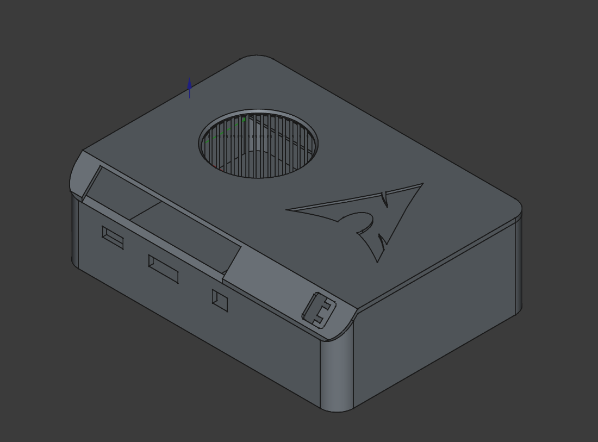

# Omni-X4: GPD Win4 based 4-in-1 compute module

This repository contains 3D-printable files for a case that transforms the [GPD Win 4](https://gpd.hk/gpdwin42025) into a versatile computing module. The module is optimized for use in four modes:

* **Mini-PC**: a compact desktop computer with external device connectivity.
* **Portable console**: game streaming to a phone via Moonlight for maximum mobility.
* **Laptop**: use with a portable monitor via VESA mount.
* **TV console**: connect to a TV for gaming and media playback.

The module features compactness, low power consumption, and a built-in battery, making it ideal for on-the-go use.

***Thingiverse***: https://www.thingiverse.com/thing:6986604